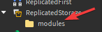

# Installation  

You can currently install **WCS** to your *project* with *3 different methods*:

### NPM Installation

Intended for only *[Typescript](https://typescriptlang.org/)* users:
Install **WCS** by running *the following command* in your *terminal*:

```bash
npm i @rbxts/wcs@latest
```

### Wally Installation

Install **WCS** using a popular package manager called **[Wally](https://wally.run/)**. Put the following line
under `[dependencies]` in your `wally.toml` file.
*Consider using the latest version*:

```md title="wally.toml"
[dependencies]
wcs = "cheetiedotpy/wcs@0.6.32"
```

### Roblox Studio Installation

If you are not using **[Rojo](https://rojo.space/)** navigate yourself to *[github releases](https://github.com/g1mmethemoney/WCSTypescript/releases/)*
page and download *rbxm* file of *the latest* version:

img here idiot

And put it under `Replicated Storage`:


